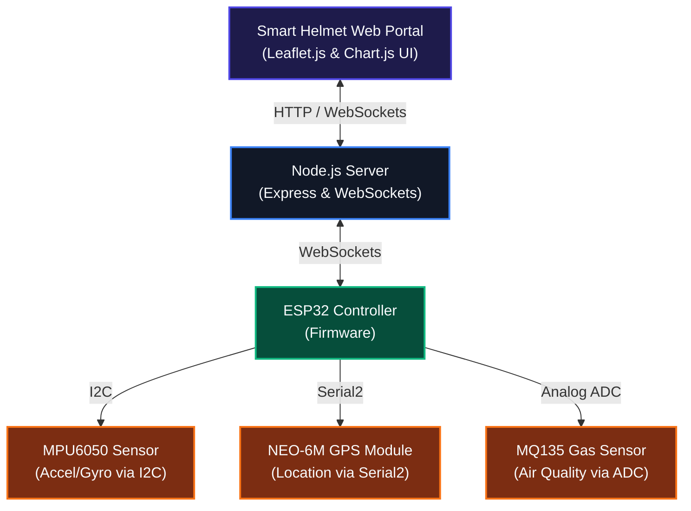

# Smart Helmet with Fall Detection and Alert System

Smart Helmet with Fall Detection and Alert System is an advanced, IoT-enabled safety and telemetry system designed to protect riders. Powered by an ESP32 microcontroller, a Node.js backend, and a real-time web-based dashboard, it monitors physical parameters (acceleration, rotation, GPS coordinates, air quality/gas concentration) to detect accidents in real-time, automatically dispatch emergency SMS alerts, and assist in locating nearby emergency services.

---

## 🛠️ Project Architecture



The system comprises three core components:
1. **ESP32 Firmware (`/esp32_firmware`):** Interfaces with physical sensors, runs edge accident-detection algorithms, manages connections with fallback logic, and buffers telemetry locally during network drops.
2. **Node.js Backend (`/server`):** Hosts the Express server, manages state routing, handles WebSocket handshakes from the helmet and the dashboard, interacts with the Twilio SMS gateway, and coordinates nearby emergency resource queries.
3. **Web Dashboard (`/server/public`):** Built with pure CSS, HTML, and vanilla Javascript. Includes interactive Leaflet JS maps, Chart.js real-time IMU graphing, a visual emergency sirens overlay, and system diagnostics panels.

---

## 🌟 Key Features

* **Real-time Telemetry Streaming:** Instant WebSocket data synchronization between the ESP32 helmet unit, node server, and dashboard (2s update interval).
* **Edge Accident Detection:** The ESP32 monitors the MPU6050 accelerometer. A sudden impact matching or exceeding **4.5 G's** triggers an immediate hardware interrupt, bypassing standard timers to dispatch a critical accident alarm.
* **Hysteresis & Alarm Latching:** Accident alerts latch for **8 seconds** to ensure warning alerts persist while monitoring post-impact forces. The alarm can be dismissed remotely from the web dashboard or will auto-clear if forces return to normal.
* **Offline Telemetry Buffer:** An on-device circular queue buffer stores telemetry frames during cellular or Wi-Fi disconnection. It automatically flushes buffered frames sequentially with a throttle delay once connection is restored.
* **Dynamic Location Services & Tracking:** Live tracking on an interactive map. If GPS signals are lost, the device flags the coordinates as stale.
* **Automated Emergency SOS Messaging:** Integrates with Twilio SMS APIs to automatically send a text alert to designated emergency contacts containing exact GPS coordinates and a Google Maps tracking link.
* **Nearby Emergency Services Finder:** Centered around the rider's position, the backend queries Google Places API (or falls back to OpenStreetMap Overpass API dynamically) to find hospitals, clinics, and police stations within a **5 km** radius, providing names, ratings, addresses, and directions.
* **Comprehensive Diagnostics Panel:** Dashboard contains controls to adjust location hops (Bangalore, New York, London), slide mock alcohol/gas concentrations, and fire a high-g collision event, allowing complete system test runs without active hardware.

---

## 🔌 Hardware Setup & Pin Mapping

Connect the sensors to your ESP32 board according to the following configurations:

| Component | Sensor Pin | ESP32 GPIO Pin | Description |
|:---|:---|:---|:---|
| **MPU6050 IMU** | VCC | 3.3V | 3.3V Power Input |
| | GND | GND | Ground |
| | SDA | **GPIO 21** | I2C Data Line |
| | SCL | **GPIO 22** | I2C Clock Line |
| **NEO-6M GPS** | VCC | 3.3V / 5V | Power Input |
| | GND | GND | Ground |
| | TXD | **GPIO 16 (RX2)** | Hardware Serial 2 Receive |
| | RXD | **GPIO 17 (TX2)** | Hardware Serial 2 Transmit |
| **MQ135 Gas Sensor** | VCC | 5V | 5V Power Input |
| | GND | GND | Ground |
| | AOUT | **GPIO 34 (ADC1)** | Analog Signal Output |

---

## 📚 Required Arduino Libraries

Before flashing the ESP32 code, install the following libraries in your Arduino IDE (`Tools -> Manage Libraries...`):

1. **Adafruit MPU6050** (by Adafruit)
2. **Adafruit Unified Sensor** (by Adafruit)
3. **TinyGPS++** (by Mikal Hart)
4. **WebSockets** (by Markus Sattler)
5. **ArduinoJson** (by Benoit Blanchon)

---

## 🚀 Setup & Execution Guide

### 1. Backend Server Installation

1. Navigate to the server folder:
   ```bash
   cd server
   ```
2. Install npm dependencies:
   ```bash
   npm install
   ```
3. Configure the environment variables:
   * Copy the sample configuration file:
     ```bash
     copy .env.example .env
     ```
   * Open the new `.env` file and input your credentials:
      * **`PORT`:** Port to host server (port: `3000`).
      * **`TWILIO_ACCOUNT_SID`**, **`TWILIO_AUTH_TOKEN`**, **`TWILIO_FROM_NUMBER`**, **`TWILIO_TO_NUMBER`**: Required for SMS alerts. *Leave blank to log SMS content to the console.*
     * **`GOOGLE_PLACES_API_KEY`**: Used to locate emergency facilities. *Leave blank to use OpenStreetMap Overpass fallback.*

4. Launch the server:
   ```bash
   npm start
   ```
   *The server runs at [http://localhost:3000](http://localhost:3000).*

---

### 2. ESP32 Firmware Configuration & Flashing

1. Open `esp32_firmware/esp32_firmware.ino` in your Arduino IDE.
2. Modify the configuration constants at the top of the file:
   * **`ssid`:** Your Wi-Fi SSID network name.
   * **`password`:** Your Wi-Fi network password.
   * **`server_host`:** Your local machine's IP address (run `ipconfig` on Windows or `ifconfig` on Linux/macOS to locate it. Ensure the ESP32 and host server are connected to the same network segment).
   * **`server_port`:** Set to match your backend port (port: `3000`).
3. Connect your ESP32 board to your computer via USB.
4. Select the appropriate board model (`Tools -> Board -> ESP32 Dev Module`) and communication port.
5. Click **Upload** to compile and transfer the program.
6. Open the **Serial Monitor** (Baud Rate: `115200`) to observe connectivity logs, sensor statuses, and diagnostics.

---

## 🖥️ Dashboard Operations & Walkthrough

The web dashboard is fully dynamic and automatically adjusts styling depending on connection state:

* **Siren Visual Overlay:** Triggering an accident (either via hardware shock or diagnostics panel UI) activates a blinking full-screen warning overlay with an alarm siren, triggering Twilio SMS dispatch, and kicking off nearby services searching.
* **IMU Real-time Chart:** Accelerometer readouts are plotted on a rolling line chart to monitor physical forces dynamically.
* **System Diagnostics:**
  * **Gas/Alcohol Slider:** Slide to test high alcohol or toxic gas values. Levels above **1,000 PPM** switch the air quality badge warning to yellow/red.
  * **Location Presets:** Toggle buttons to snap coordinates between Bangalore, New York, or London to test spatial API queries.
  * **Trigger Impact Button:** Instantly triggers a test crash vector, testing warning triggers and API fallbacks.
  * **False Alarm/Dismiss button:** Allows clearing active accident states, updating the hardware through server-side back-propagation.
