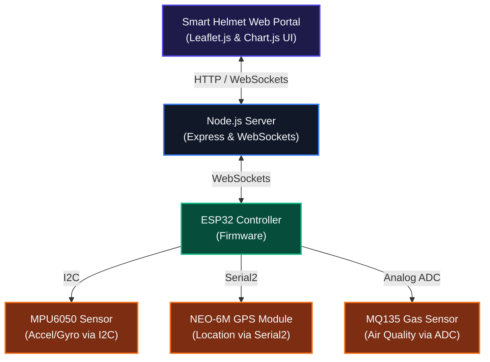

# Comprehensive Project Details: Aegis Smart Helmet

The Aegis Smart Helmet with Fall Detection and Alert System is an advanced, IoT-enabled safety and telemetry system designed to protect motorcycle riders. It monitors physical parameters such as acceleration, rotation, GPS coordinates, and air quality to detect accidents in real-time, automatically dispatch emergency SMS alerts, and assist in locating nearby emergency services.

## 1. Project Architecture

The system operates across an embedded edge device, a centralized server, and a web interface, coordinating over WebSockets and REST APIs.

## 2. Hardware Setup & Pin Mapping

The physical helmet relies on an ESP32 microcontroller with specific sensor wirings.

| Component | Sensor Pin | ESP32 GPIO Pin | Wire Color Code (Reference) | Description |
|:---|:---|:---|:---|:---|
| **MPU6050 IMU** | VCC | 3.3V | Blue | 3.3V Power Input |
| | GND | GND | Green | Ground |
| | SDA | **GPIO 21** | Blue | I2C Data Line |
| | SCL | **GPIO 22** | Black | I2C Clock Line |
| **NEO-6M GPS** | VCC | 3.3V / 5V | Red | Power Input |
| | GND | GND | White | Ground |
| | TXD | **GPIO 16 (RX2)** | Yellow | Hardware Serial 2 Receive |
| | RXD | **GPIO 17 (TX2)** | White | Hardware Serial 2 Transmit |
| **MQ135 Gas Sensor** | VCC | 5V | Brown | 5V Power Input |
| | GND | GND | Blue | Ground |
| | AOUT | **GPIO 34 (ADC1)**| Yellow | Analog Signal Output |

*General ESP32 power pins use Violet for 5V, White for GND, and Green for 3.3V.*

## 3. ESP32 Firmware Details (Background Operations)

The ESP32 runs C++ firmware compiled via the Arduino IDE. It manages sensors, thresholds, buffers, and connectivity protocols.

### 3.1 Constants and Thresholds
- **Telemetry Interval:** Sends data to the server every **2000 ms** (2 seconds).
- **Accident Threshold:** The impact force is calculated by root-mean-square of X, Y, and Z axes. If the total acceleration meets or exceeds **4.5 G's**, an accident is triggered immediately (bypassing normal timer loops).
- **Accident Latch:** Once triggered, the accident state latches for **8000 ms** (8 seconds). Hysteresis ensures the alarm doesn't rapidly toggle. After 8 seconds of sub-threshold G-force, the state automatically resets. It can also be overridden remotely via a `RESET_ACCIDENT` WebSocket payload.
- **GPS Staleness:** If no valid GPS data is encoded for **30000 ms** (30 seconds), the coordinates are flagged as stale.

### 3.2 Offline Telemetry Circular Buffer
To combat network instability, a local in-memory structure ensures critical logs are not lost.
- **Buffer Size:** **12 elements** (`BUFFER_SIZE 12`).
- **Packet Size:** Each `TelemetryFrame` struct stored in the memory buffer takes up **64 bytes** of RAM. When serialized to JSON for transmission over WebSockets, the payload size varies depending on values but is generally around 300-400 bytes per frame.
- **Behavior:** Operates as a circular queue. If a packet cannot be dispatched because of missing WiFi or WebSocket connection, it is pushed to this buffer. If the buffer overflows, the oldest frame is overwritten.
- **Flush Mechanism:** On WebSocket reconnection, all buffered telemetry is sequentially pushed out with an **80 ms delay** per packet to avoid TCP/IP network congestion spikes.

### 3.3 Connectivity & Exponential Backoff
- **WiFi Connection:** Initial reconnection backoff is **10 seconds**, doubling exponentially on consecutive failures, up to a maximum delay of **120 seconds**.
- **WebSocket Connection:** The WebSocket reconnect starts with a **1 second** backoff, scaling up exponentially to **120 seconds**.

### 3.4 Hardware Failsafes
- **MPU6050 Fallback:** The system first attempts to initialize the MPU6050 via the Adafruit library. If this fails, the system safely falls back to a **raw I2C communication mode**, manually waking up the sensor (`PWR_MGMT_1` register to `0x00`) and manually configuring the ranges (+/- 8G for accelerometer, +/- 500 deg/s for gyroscope).
- **MQ135 Scaling:** The 12-bit ADC reads values from 0-4095 and linearly maps them to 0-10,000 PPM (Parts Per Million).

## 4. Node.js Backend Operations

The server processes incoming telemetry, hosts the frontend dashboard, and manages outbound third-party API interactions.

### 4.1 WebSocket Channels
- **Endpoints:** Divides socket paths into `/esp32` (hardware client) and `/dashboard` (UI clients).
- **Test Mode Fallback:** If the ESP32 disconnects, the server automatically starts a simulation loop (`testingInterval`) every **2000 ms**. It generates subtle drifting mock GPS data, mock IMU fluctuations floating around 1G, and randomized gas PPM shifts to keep the UI active.

### 4.2 Twilio SMS Rate Limiting & Dispatch
- To prevent spam when repeated crashes occur, an SMS cooldown of **30000 ms** (30 seconds) is strictly enforced.
- The server checks `Date.now() - lastSmsSentTime`. If an SMS attempt occurs within 30 seconds of the prior one, it is blocked and the wait time is logged to the console.
- Alert types: Hardware crash detection, and Manual Web SOS detection (`/api/sos`). SMS alerts include GPS coordinates and a Google Maps tracking URL.

### 4.3 Emergency Resource Finder (Cascading Fallback)
The backend exposes the `/api/nearby-emergency` endpoint to query hospitals and police stations within a **5 km** (5000m) radius.
1. **Primary - Google Places API:** If `GOOGLE_PLACES_API_KEY` is present, it runs two nearby searches (`type=hospital`, `type=police`).
2. **Secondary - OpenStreetMap (OSM) Overpass API:** If the Google key is missing or fails, a custom Overpass Query checks nodes and ways tagged as `hospital`, `clinic`, or `police` within the radius.
3. **Tertiary - Hardcoded Fallback:** If Overpass fails, a static fallback list of 5 real emergency locations in Bangalore (BGS Hospital, Fortis, Avasa, Kengeri Police, Jnanabharathi Police) is sent back to the dashboard.

## 5. Web Dashboard Client

The frontend utilizes vanilla JavaScript, HTML, and pure CSS.
- **Map & Charts:** Connects to `Leaflet.js` for geospatial tracking and `Chart.js` for plotting 3-axis IMU acceleration.
- **Controls & Diagnostics:**
  - Includes sliders to artificially override PPM values and trigger warnings for toxic levels (yellow/red warnings > 1,000 PPM).
  - Ability to spoof GPS bounds to cities like London or New York.
  - A test "Trigger Impact" button forces a mock severe impact on the UI, sets telemetry.accident to true, simulates coordinates, dispatches Twilio SMS, and auto-unlatches after **8000 ms**.
  - A "Dismiss Alarm" button dispatches `DISMISS_ALARM` to the backend, which forwards a `RESET_ACCIDENT` WebSocket payload down to the ESP32 hardware to clear the physical latch.
